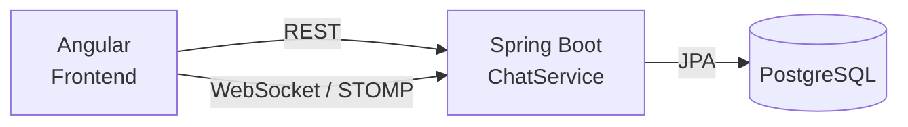
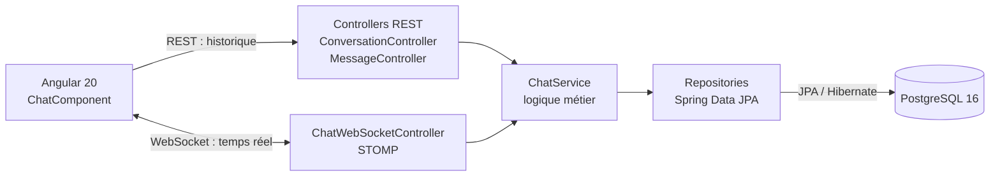
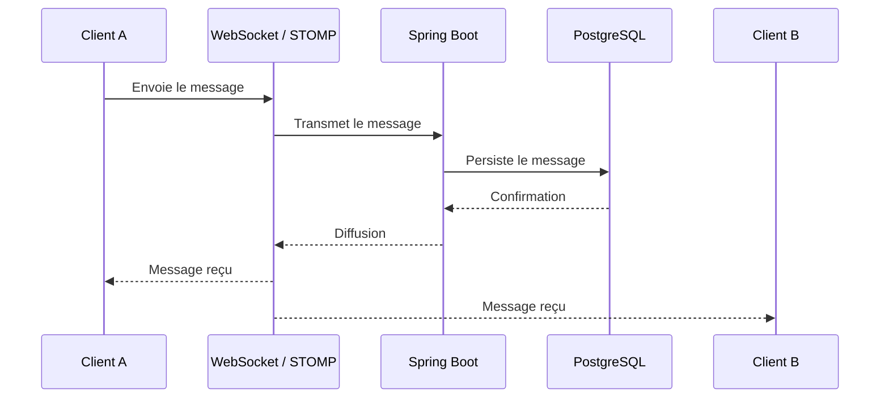
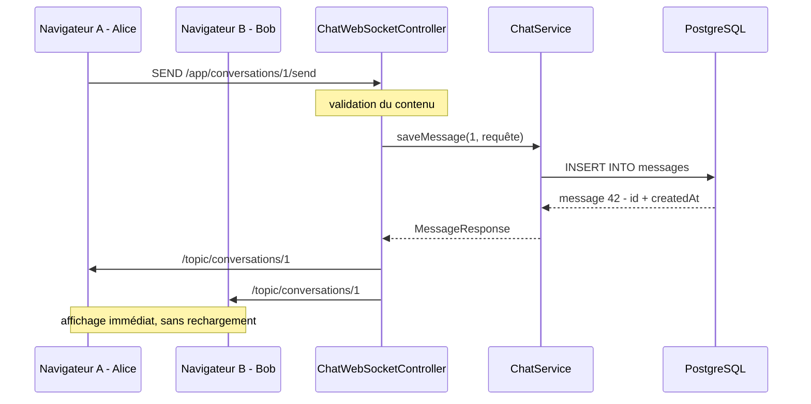
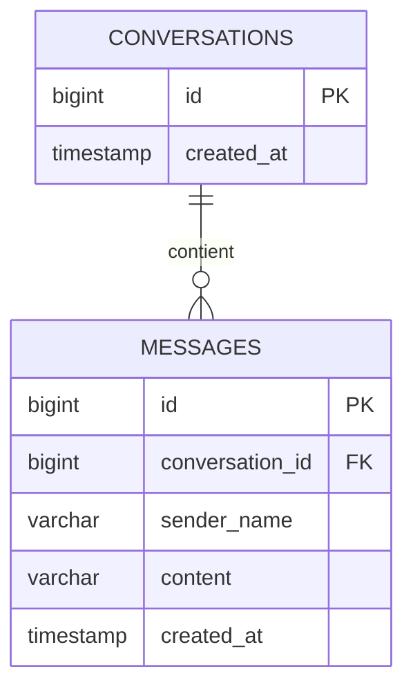

# 🚗 Your Car Your Way — Chat PoC

<p align="center">
  <strong>Preuve de concept d'un tchat temps réel</strong><br/>
  Validation de l'intégration <strong>Angular · Spring Boot · WebSocket · PostgreSQL</strong>
</p>

<p align="center">
  
  
  
  
  
  
</p>

> 💬 **Objectif :** démontrer la faisabilité d'un tchat temps réel dans l'architecture cible de **Your Car Your Way**, avec un périmètre volontairement limité à cette fonctionnalité.

---

## 🧭 Vue d'ensemble



### ✨ Fonctionnalités démontrées

- 💬 envoi et réception de messages ;
- ⚡ communication temps réel via WebSocket / STOMP ;
- 💾 persistance des messages dans PostgreSQL ;
- 🔄 récupération de l'historique via REST ;
- 🧩 séparation claire des responsabilités ;
- 🐳 environnement PostgreSQL reproductible avec Docker ;
- 🧪 tests ciblés sur les mécanismes principaux.

---

## 📑 Sommaire

| | | |
|---|---|---|
| [1. Présentation](#1--présentation) | [9. Configuration](#9-️-configuration) | [17. Accessibilité](#17--accessibilité) |
| [2. Objectif du PoC](#2--objectif-du-poc) | [10. Lancer le projet](#10--lancer-le-projet) | [18. Impact écologique](#18--impact-écologique) |
| [3. Périmètre](#3--périmètre) | [11. Tester le tchat](#11--tester-le-tchat) | [19. Git et GitHub](#19--git-github-et-intégration-dans-léquipe) |
| [4. Hors périmètre](#4--hors-périmètre) | [12. API REST](#12--api-rest) | [20. Reproductibilité](#20--reproductibilité-de-lenvironnement) |
| [5. Architecture](#5-️-architecture) | [13. WebSocket](#13--websocket) | [21. Limites du PoC](#21-️-limites-du-poc) |
| [6. Structure du projet](#6--structure-du-projet) | [14. Tests](#14--tests) | [22. Évolutions possibles](#22--évolutions-possibles) |
| [7. Prérequis](#7-️-prérequis) | [15. Choix techniques](#15--choix-techniques) | [Annexe — Modèle de données](#annexe--modèle-de-données) |
| [8. Installation](#8--installation) | [16. Internationalisation](#16--internationalisation) | |

---

## 1. 📌 Présentation

Your Car Your Way modernise ses applications web internationales. L'architecture cible retenue est
un **monolithe modulaire** : frontend Angular, backend Spring Boot exposant une API REST, base
PostgreSQL, le tout reproductible avec Docker.

Une fonctionnalité de cette cible sort du cadre « requête / réponse » habituel : le **tchat entre un
client et un conseiller**, qui doit être temps réel. Ce dépôt contient une **preuve de concept (PoC)**
limitée à cette fonctionnalité, afin de vérifier qu'elle s'intègre proprement dans l'architecture
validée, **sans introduire de microservices**.

Ce n'est pas le produit final : c'est une démonstration technique.

## 2. 🎯 Objectif du PoC

> Valider techniquement la faisabilité d'un tchat temps réel dans l'architecture cible de
> Your Car Your Way.

Concrètement, le PoC démontre que :

1. Angular communique avec Spring Boot ;
2. Spring Boot gère une communication WebSocket ;
3. deux clients échangent des messages en temps réel ;
4. chaque message est persisté dans PostgreSQL ;
5. l'historique est récupérable via une API REST ;
6. REST et WebSocket cohabitent proprement dans le même backend ;
7. l'environnement se lance facilement (Docker Compose) ;
8. un développeur junior peut comprendre et démarrer le projet avec ce README.

## 3. ✅ Périmètre

Inclus dans ce PoC :

- une conversation identifiée par un identifiant numérique ;
- consultation de l'historique des messages ;
- envoi d'un message ;
- réception des nouveaux messages en temps réel, sans rechargement de page ;
- persistance de chaque message dans PostgreSQL ;
- récupération de l'historique après un rafraîchissement (F5) ;
- API REST : création d'une conversation, lecture d'une conversation, lecture de l'historique ;
- endpoint WebSocket dédié au tchat ;
- tests backend (service, persistance, endpoint REST, intégration WebSocket) et test frontend ;
- démarrage de PostgreSQL via Docker Compose.

## 4. 🚫 Hors périmètre

Volontairement **non développé**, car non nécessaire à la démonstration :

réservation, paiement, gestion des véhicules, gestion des agences, gestion des comptes clients,
back-office d'administration, notifications e-mail, SMS, pièces jointes, partage de fichiers,
appels audio, appels vidéo, réactions, emojis avancés, recherche avancée, groupes, indicateurs de
présence ou de saisie, authentification et autorisation, architecture microservices, Kubernetes,
infrastructure cloud, stack de monitoring complète.

L'expéditeur est identifié par un **simple nom saisi dans l'interface**. C'est une simplification
assumée du PoC : il n'y a **aucune authentification**.

## 5. 🏗️ Architecture

Le PoC repose sur une architecture simple : Angular consomme l'API REST pour les opérations
classiques et utilise WebSocket / STOMP pour les échanges temps réel. Le backend Spring Boot
centralise la logique métier et la persistance PostgreSQL.



Lecture du diagramme :

- Angular utilise **deux canaux complémentaires** vers le même backend. REST pour ce qui est
  ponctuel (charger l'historique au démarrage ou après un F5), WebSocket pour ce qui est continu
  (recevoir les messages des autres participants).
- Les contrôleurs REST et WebSocket sont de simples adaptateurs : ils délèguent tout à
  `ChatService`. **La logique métier n'est écrite qu'une fois.**
- `ChatService` est la seule couche qui parle aux repositories ; les repositories sont les seuls à
  parler à la base.
- Aucun composant supplémentaire (broker externe, service séparé) n'est nécessaire : le PoC reste
  un monolithe modulaire, conformément à l'architecture validée.

### Flux d'un message



Cette organisation permet de conserver une seule logique métier côté backend tout en exposant deux
canaux de communication adaptés à leurs usages : REST pour les opérations classiques et WebSocket
pour le temps réel.

## 6. 📁 Structure du projet

```text
your-car-your-way-chat-poc/
├── docker-compose.yml          # PostgreSQL pour le développement local
├── .env.example                # Variables d'environnement à copier en .env
├── .gitignore
├── README.md
│
├── backend/                    # Application Spring Boot
│   ├── pom.xml
│   └── src/
│       ├── main/java/com/yourcaryourway/chat/
│       │   ├── ChatApplication.java                 # Point d'entrée
│       │   ├── config/
│       │   │   ├── WebSocketConfig.java             # Endpoint /ws, préfixes /app et /topic
│       │   │   ├── CorsConfig.java                  # CORS de l'API REST (développement)
│       │   │   ├── WebSocketEventLogger.java        # Logs connexion / déconnexion
│       │   │   └── DemoConversationInitializer.java # Crée la conversation n° 1
│       │   ├── controller/
│       │   │   ├── ConversationController.java      # REST : créer / lire une conversation
│       │   │   ├── MessageController.java           # REST : historique
│       │   │   └── ChatWebSocketController.java     # WebSocket : envoi + diffusion
│       │   ├── service/
│       │   │   └── ChatService.java                 # Logique métier du tchat
│       │   ├── repository/                          # Accès aux données (Spring Data JPA)
│       │   ├── entity/                              # Conversation, Message
│       │   ├── dto/                                 # Contrats d'entrée / sortie
│       │   └── exception/                           # Erreurs métier + handler REST
│       ├── main/resources/
│       │   └── application.properties
│       └── test/                                    # Tests unitaires et d'intégration
│
└── frontend/                   # Application Angular
    ├── package.json
    ├── angular.json
    └── src/
        ├── environments/
        │   └── environment.ts                       # URL du backend
        └── app/
            ├── app.component.ts
            ├── app.config.ts
            ├── chat/                                # Écran du tchat
            ├── services/
            │   ├── chat-api.service.ts              # Appels REST
            │   └── chat-socket.service.ts           # Connexion WebSocket / STOMP
            └── models/
                └── chat.model.ts                    # Types partagés avec l'API
```

La séparation permet d'identifier rapidement les responsabilités de chaque partie du PoC sans
mélanger le code frontend et backend.

## 7. 🛠️ Prérequis

| Outil | Version utilisée | Remarque |
|---|---|---|
| Java (JDK) | 21 | version cible du `pom.xml` |
| Maven | 3.9+ | ou l'exécution Maven intégrée à votre IDE |
| Node.js | 22.x | Angular 20 exige `^20.19`, `^22.12` ou `^24` |
| npm | 10.x | installé avec Node.js |
| Angular CLI | 20.x | inutile globalement : `npx ng …` utilise la version du projet |
| Docker | Compose v2 (`docker compose`) | pour PostgreSQL |
| Git | 2.x | |

Vérification rapide :

```bash
java -version
mvn -version
node -v
npm -v
docker compose version
```

## 8. 📥 Installation

```bash
git clone <url-du-depot>
cd your-car-your-way-chat-poc
```

Démarrer la base de données :

```bash
docker compose up -d
```

Installer les dépendances du frontend :

```bash
cd frontend
npm install
cd ..
```

Le backend télécharge ses dépendances tout seul au premier `mvn` (aucune commande d'installation
séparée).

### ⚡ Démarrage rapide

```bash
# 1. Démarrer PostgreSQL
docker compose up -d

# 2. Démarrer le backend
cd backend
mvn spring-boot:run

# 3. Dans un autre terminal, démarrer le frontend
cd frontend
npm install
npm start
```

L'application est alors disponible sur `http://localhost:4200`.

---

## 9. ⚙️ Configuration

**PostgreSQL (`docker-compose.yml`)**

| Paramètre | Valeur par défaut |
|---|---|
| base | `ycyw_chat` |
| utilisateur | `ycyw` |
| mot de passe | `ycyw-local-dev` |
| port | `5432` |

Ces valeurs sont des **valeurs de développement local**, pas des secrets. Aucun secret réel n'est
versionné. Pour les surcharger : `cp .env.example .env` puis modifier le `.env` (non versionné).

**Backend (`backend/src/main/resources/application.properties`)**

Toutes les valeurs sensibles sont externalisées et surchargeables par variable d'environnement :

| Variable | Défaut |
|---|---|
| `DATABASE_URL` | `jdbc:postgresql://localhost:5432/ycyw_chat` |
| `DATABASE_USERNAME` | `ycyw` |
| `DATABASE_PASSWORD` | `ycyw-local-dev` |
| `APP_CORS_ALLOWED_ORIGINS` | `http://localhost:4200` |

Le schéma de base est généré par Hibernate (`spring.jpa.hibernate.ddl-auto=update`) : c'est une
simplification de PoC, voir la section « Limites ».

**Ports utilisés**

| Service | Port |
|---|---|
| Frontend Angular | 4200 |
| Backend Spring Boot | 8080 |
| PostgreSQL | 5432 |

**WebSocket** : endpoint `ws://localhost:8080/ws`, préfixe d'envoi `/app`, préfixe de diffusion
`/topic`. Les origines autorisées pour la poignée de main sont les mêmes que pour le CORS REST.

**Frontend (`frontend/src/environments/environment.ts`)** : `apiBaseUrl`, `wsUrl` et
`defaultConversationId`. À modifier si vous changez les ports du backend.

## 10. ▶️ Lancer le projet

Trois terminaux, dans cet ordre.

**1 — Base de données**

```bash
docker compose up -d
docker compose ps          # postgres doit être "healthy"
```

**2 — Backend**

```bash
cd backend
mvn spring-boot:run
```

Le backend écoute sur `http://localhost:8080`. Au premier démarrage sur une base vide, il crée une
conversation de démonstration (identifiant `1`) et l'écrit dans les logs.

**3 — Frontend**

```bash
cd frontend
npm start
```

L'application est disponible sur `http://localhost:4200`.

Pour arrêter : `Ctrl+C` dans les deux terminaux, puis `docker compose down`
(`docker compose down -v` pour supprimer aussi les données).

## 11. 🧪 Tester le tchat

1. Lancer les trois composants (section 10).
2. Ouvrir `http://localhost:4200` dans un premier navigateur (ou onglet) — **A**.
3. Ouvrir la même URL dans un second navigateur, ou une fenêtre de navigation privée — **B**.
4. Sur A, saisir le nom `Alice` ; sur B, saisir le nom `Bob`. Les deux gardent l'identifiant de
   conversation `1` et cliquent sur **Rejoindre**. L'indicateur affiche « Temps réel : connecté ».
5. Depuis A, écrire `Bonjour` et cliquer sur **Envoyer**.
6. Vérifier que le message apparaît **immédiatement sur B**, sans rechargement.
7. Depuis B, répondre `Bonjour Alice` et vérifier la réception immédiate sur A.
8. Rafraîchir la page (F5) sur A **et** sur B.
9. Vérifier que les deux messages sont toujours affichés : ils viennent de PostgreSQL, via REST.

Vérifier la persistance directement en base (facultatif) :

```bash
docker exec -it ycyw-chat-postgres psql -U ycyw -d ycyw_chat \
  -c "SELECT id, sender_name, content, created_at FROM messages ORDER BY id;"
```

## 12. 🔌 API REST

Base : `http://localhost:8080/api`

### `GET /api/conversations/{conversationId}/messages`

Historique complet d'une conversation, du plus ancien au plus récent.

| Élément | Détail |
|---|---|
| Paramètre | `conversationId` (chemin, entier) |
| Réponse | `200 OK` — tableau de messages |
| Erreurs | `404` conversation inconnue, `400` identifiant non numérique |

```json
[
  {
    "id": 1,
    "conversationId": 1,
    "senderName": "Alice",
    "content": "Bonjour",
    "createdAt": "2026-01-01T10:00:00Z"
  }
]
```

### `POST /api/conversations`

Crée une conversation vide (utile pour démontrer plusieurs fils de discussion).

| Élément | Détail |
|---|---|
| Corps | aucun |
| Réponse | `201 Created` — `{ "id": 2, "createdAt": "..." }` |

### `GET /api/conversations/{conversationId}`

Vérifie l'existence d'une conversation.

| Élément | Détail |
|---|---|
| Réponse | `200 OK` — `{ "id": 1, "createdAt": "..." }` |
| Erreurs | `404` conversation inconnue |

### Format des erreurs

```json
{ "status": 404, "message": "Conversation introuvable : 99", "timestamp": "2026-01-01T10:00:00Z" }
```

Exemples avec curl :

```bash
curl http://localhost:8080/api/conversations/1/messages
curl -X POST http://localhost:8080/api/conversations
```

## 13. ⚡ WebSocket

| Élément | Valeur |
|---|---|
| URL de connexion | `ws://localhost:8080/ws` |
| Protocole | STOMP sur WebSocket natif (pas de SockJS) |
| Destination d'envoi | `/app/conversations/{conversationId}/send` |
| Destination d'abonnement | `/topic/conversations/{conversationId}` |

**Message envoyé par le client** :

```json
{ "senderName": "Alice", "content": "Bonjour" }
```

`senderName` : obligatoire, 50 caractères maximum. `content` : obligatoire, 1000 caractères maximum.
Un message invalide est rejeté côté serveur et journalisé ; il n'est ni enregistré, ni diffusé.

**Message diffusé par le serveur** (identique au format REST) :

```json
{
  "id": 1,
  "conversationId": 1,
  "senderName": "Alice",
  "content": "Bonjour",
  "createdAt": "2026-01-01T10:00:00Z"
}
```

### Pourquoi WebSocket, et pas seulement REST ?

REST fonctionne en requête / réponse : **seul le client peut déclencher un échange**. Pour afficher
le message d'un autre participant, il faudrait interroger le serveur en boucle (polling), ce qui
coûte cher en requêtes inutiles tout en gardant un délai perceptible.

WebSocket ouvre une connexion permanente et bidirectionnelle : **le serveur peut pousser** un
message vers les clients dès qu'il arrive. C'est exactement le besoin du tchat.

Les deux approches sont **complémentaires** et c'est ce que le PoC valide : REST pour l'historique
(ponctuel, cacheable, facile à tester), WebSocket pour le flux temps réel.

### Trajet détaillé d'un message



Points importants :

- **Le message est persisté avant d'être diffusé.** Un client ne peut donc pas afficher un message
  absent de la base : l'historique rechargé après un F5 est toujours cohérent avec ce qui a été vu.
- L'expéditeur reçoit lui aussi la diffusion : tous les clients affichent la même version du message
  (même identifiant, même horodatage serveur).
- La diffusion est faite par le **broker en mémoire** de Spring vers tous les abonnés du topic de la
  conversation. Les autres conversations ne reçoivent rien.

## 14. ✅ Tests

**Backend**

```bash
cd backend
mvn test
```

| Test | Ce qu'il vérifie |
|---|---|
| `ChatServiceTest` | envoi d'un message (contenu nettoyé, DTO renvoyé), refus si la conversation n'existe pas, ordre de l'historique |
| `MessageRepositoryTest` | persistance réelle et relecture ordonnée, cloisonnement entre conversations |
| `MessageControllerTest` | endpoint REST `GET …/messages` : réponse `200` et cas `404` |
| `ChatWebSocketIntegrationTest` | un client STOMP réel envoie un message : il est diffusé aux abonnés **et** présent en base |

Les tests utilisent une base **H2 en mémoire** : ils s'exécutent sans Docker et sans PostgreSQL.
C'est un compromis de PoC ; un projet réel utiliserait Testcontainers pour tester sur le même moteur
qu'en production.

**Frontend**

```bash
cd frontend
npm test                 # mode interactif, ouvre un navigateur
npm run test:ci          # exécution unique, Chrome headless (nécessite Chrome installé)
```

`ChatApiService` est couvert par `chat-api.service.spec.ts` (lecture de l'historique et création
d'une conversation, avec `HttpTestingController`).

La couverture n'est volontairement pas maximisée : les tests ciblent le mécanisme central du PoC.

Avant la remise, exécuter les tests sur l'environnement de développement et conserver le résultat du
build et des tests comme preuve de bon fonctionnement.

## 15. 🧠 Choix techniques

| Choix | Raison |
|---|---|
| **Angular** | imposé par l'architecture cible ; framework structurant (TypeScript, injection de dépendances, tests intégrés) adapté à une application internationale maintenue dans la durée |
| **Spring Boot** | imposé par l'architecture cible ; REST, WebSocket, JPA et tests dans un seul écosystème, ce qui évite d'ajouter une brique technique juste pour le temps réel |
| **PostgreSQL** | imposé par l'architecture cible ; SGBD relationnel éprouvé, adapté à des données structurées et historisées comme des messages |
| **REST** | standard pour les échanges ponctuels ; simple à tester, à documenter et à mettre en cache |
| **WebSocket** | seul moyen d'obtenir une diffusion serveur → clients sans polling (voir section 13) |
| **STOMP** (sur WebSocket) | fournit nativement l'abonnement par destination (`/topic/conversations/{id}`) : Spring gère la liste des abonnés, le code applicatif se limite à une ligne de diffusion. Plus lisible qu'un registre de sessions écrit à la main |
| **WebSocket natif, sans SockJS** | SockJS n'apporte qu'une compatibilité avec des navigateurs qui ne gèrent pas WebSocket ; ce n'est plus le cas aujourd'hui, et l'enlever réduit le code et les concepts à comprendre |
| **Docker Compose** | environnement reproductible : un développeur junior obtient la même base que tout le monde en une commande |
| **Broker en mémoire** | suffisant pour une instance unique ; un broker externe (RabbitMQ) serait nécessaire seulement à la mise à l'échelle (voir section 22) |

## 16. 🌍 Internationalisation

L'application cible de Your Car Your Way est internationale. L'architecture cible prévoit donc
l'internationalisation des textes et la gestion des formats locaux (dates, heures, nombres, devises)
ainsi que des fuseaux horaires explicites.

Le PoC ne met volontairement pas en œuvre un système i18n complet afin de conserver un périmètre
strictement limité à la validation du tchat. Les libellés de l'interface sont actuellement statiques.

Cette limitation est volontaire et devra être levée lors de l'implémentation du produit. L'objectif
sera d'utiliser un mécanisme de ressources multilingues plutôt que de dupliquer le code par pays.

## 17. ♿ Accessibilité

L'accessibilité est prise en compte dès le PoC, sans prétendre à une conformité RGAA complète.

Les éléments actuellement pris en compte sont notamment :

- structure HTML sémantique ;
- labels associés aux champs ;
- navigation au clavier ;
- focus visible ;
- messages et erreurs compréhensibles ;
- utilisation de `aria-live` pour les nouveaux messages ;
- contraste suffisant ;
- information ne dépendant pas uniquement de la couleur.

Un audit RGAA complet n'est pas inclus dans le périmètre de cette preuve de concept.

## 18. 🌱 Impact écologique

L'impact écologique est pris en compte comme contrainte de conception, conformément à l'architecture
cible. Dans le périmètre de ce PoC :

- l'interface reste volontairement légère ;
- aucune dépendance frontend inutile n'est ajoutée pour le fonctionnement du tchat ;
- l'historique est chargé à la demande via REST ;
- la communication temps réel utilise WebSocket afin d'éviter un mécanisme de polling périodique
  pour rechercher continuellement de nouveaux messages ;
- les traitements et échanges réseau restent limités au strict nécessaire pour démontrer le
  fonctionnement du tchat.

Ces choix constituent des mesures d'écoconception à l'échelle du PoC. Ils ne constituent pas une
mesure complète de l'empreinte environnementale de l'application.

Pour le produit final, les performances, le poids des ressources, la pagination, le cache et les
traitements répétitifs devront être évalués plus largement.

## 19. 🔧 Git, GitHub et intégration dans l'équipe

Le projet est versionné avec Git et doit être publié dans un dépôt GitHub afin de respecter le
processus de développement attendu.

Le dépôt recommandé est :

```text
your-car-your-way-chat-poc
```

Après création du dépôt GitHub :

```bash
git remote add origin <url-du-depot>
git push -u origin main
```

Les commits doivent rester organisés par évolution fonctionnelle ou technique afin de faciliter la
lecture de l'historique par les autres développeurs.

Le `.gitignore` exclut notamment les dépendances, artefacts de build, fichiers IDE et fichiers
d'environnement locaux.

## 20. 📦 Reproductibilité de l'environnement

Le PoC utilise Docker Compose pour fournir PostgreSQL dans un environnement de développement
reproductible.

Avant de présenter le PoC au jury, vérifier sur une machine de développement propre que :

```bash
docker compose up -d
```

démarre correctement PostgreSQL, puis que les tests et l'application fonctionnent avec les versions
documentées dans la section « Prérequis ».

Le projet peut être lancé depuis un IDE ou depuis les commandes indiquées dans ce README.

Un Maven Wrapper (`mvnw` / `mvnw.cmd`) peut être ajouté dans une évolution ultérieure afin de
verrouiller également la version de Maven et de réduire encore les prérequis locaux.

## 21. ⚠️ Limites du PoC

Ce projet est une **preuve de concept**, pas une version de production. En l'état :

- **Aucune authentification ni autorisation** : l'expéditeur est un nom libre saisi dans l'interface,
  et n'importe qui peut rejoindre n'importe quelle conversation en changeant l'identifiant. Un vrai
  déploiement exigerait une authentification et un contrôle d'accès à la conversation.
- **Schéma géré par Hibernate** (`ddl-auto=update`) au lieu de migrations versionnées
  (Flyway / Liquibase).
- **Broker en mémoire** : une seule instance backend. Avec plusieurs instances, deux clients
  connectés à des instances différentes ne se verraient pas.
- **Erreurs WebSocket seulement journalisées** côté serveur : le client n'est pas notifié qu'un
  message a été rejeté.
- **Pas de pagination de l'historique** : la conversation est chargée en entier.
- **Pas de reprise de l'historique après reconnexion** : la reconnexion automatique est active, mais
  les messages reçus pendant une coupure ne sont pas rattrapés (un F5 les récupère).
- **Tests sur H2**, pas sur PostgreSQL.
- **CORS ouvert au frontend de développement** uniquement ; à durcir avant tout déploiement.
- **Interface volontairement minimale** : le PoC ne démontre pas de compétences UI. Les bases
  d'accessibilité sont respectées (voir section 17), mais aucun audit RGAA complet n'a été mené.

## 22. 🚀 Évolutions possibles

À envisager **après** validation du PoC, si le tchat est intégré au produit :

- authentification et rattachement des messages à un compte client / conseiller ;
- file d'attente et affectation des conversations à un conseiller disponible ;
- indicateurs de présence, de saisie et accusés de lecture ;
- pagination de l'historique et rattrapage des messages après reconnexion ;
- pièces jointes, puis appels audio et vidéo (prévus au cahier des charges, hors PoC) ;
- migrations de schéma versionnées (Flyway) ;
- broker externe (RabbitMQ) pour supporter plusieurs instances backend ;
- conteneurisation du backend et du frontend, puis intégration à la chaîne CI/CD ;
- observabilité complète (métriques, traces, agrégation de logs) ;
- internationalisation complète de l'interface ;
- tests d'intégration sur PostgreSQL via Testcontainers, et tests end-to-end du scénario à deux
  clients.

## Annexe — Modèle de données



Modèle **minimal**, limité au strict nécessaire pour démontrer le tchat : une conversation contient
plusieurs messages, un message appartient à une conversation. Le modèle métier complet de
Your Car Your Way (clients, agences, véhicules, réservations) n'est volontairement pas reproduit.

`sender_name` remplace une véritable référence utilisateur, faute d'authentification dans le PoC.

---

<p align="center">
  <sub>PoC technique — Your Car Your Way</sub>
</p>
